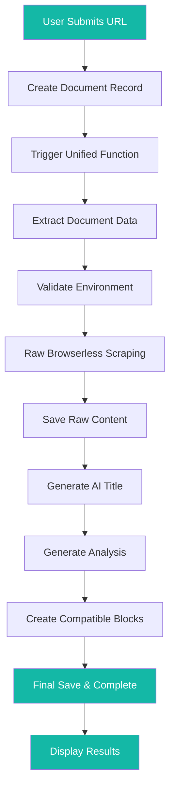

# Docify - AI-Powered Document Analysis

Docify is a web application that allows users to analyze any website using AI-powered content extraction and visualization. Users can input a URL and instructions, and the system will scrape the content, analyze it with Google's Gemini AI, and present the results in interactive charts and summaries.

## 🎯 Key Features

- **🔒 Raw Content Preservation**: Saves exact browserless HTML without dangerous cleaning
- **🤖 AI-Generated Titles**: Smart 2-4 word titles using Gemini AI
- **📝 Readable Summaries**: Human-friendly summaries up to 200 characters
- **🔗 Format Compatibility**: Same JSON blocks format as original analyzer
- **🎯 8-Step Linear Process**: Clear, reliable processing pipeline
- **🛡️ Error Recovery**: Graceful failure handling with status updates
- **🌐 Universal Web Scraping**: Extract content from any website
- **📊 Interactive Visualizations**: Automatic generation of Mermaid diagrams and charts
- **📱 Responsive Design**: Works on all devices with adaptive grid layouts

## 🔄 How It Works



## 🏗️ Architecture

```
┌─────────────────┐    ┌─────────────────────┐    ┌─────────────────┐
│   User Input    │    │   Unified Function   │    │   Results View  │
│   (Frontend)    │───▶│   (Appwrite)         │───▶│   (Frontend)    │
│                 │    │   8-Step Process     │    │                 │
└─────────────────┘    └─────────────────────┘    └─────────────────┘
         │                       │                       │
         ▼                       ▼                       ▼
┌─────────────────┐    ┌─────────────────┐    ┌─────────────────┐
│   Document      │    │   Gemini AI     │    │   Browserless   │
│   Creation      │    │   (Analysis)    │    │   (Scraping)    │
│   (Database)    │    │                 │    │                 │
└─────────────────┘    └─────────────────┘    └─────────────────┘
```

### 🔄 Processing Flow
1. **User submits URL** → Document record created
2. **Unified function triggered** → 8-step processing begins
3. **Raw content scraped** → Exact HTML preserved
4. **AI analysis performed** → Gemini generates insights
5. **Results formatted** → Compatible with existing frontend
6. **Document updated** → Ready for display

### 🛠️ Technical Stack
- **Frontend**: SvelteKit with TypeScript
- **Backend**: Appwrite Functions (Python)
- **Database**: Appwrite Database (consolidated schema)
- **AI**: Google Gemini 2.5 Pro
- **Scraping**: Browserless.io + Requests
- **Hosting**: Vercel (frontend) + Appwrite Cloud (backend)

## 📋 Prerequisites

- Node.js 18+
- npm or yarn
- Python 3.9+ (for function development)
- Appwrite account and project
- Google Gemini API key
- Browserless.io API key (optional, enhances scraping)

## 🛠️ Setup Instructions

### 1. Appwrite Project Setup

1. Create a new project on [Appwrite Cloud](https://cloud.appwrite.io)
2. Note your Project ID and API Endpoint
3. Enable the following services:
   - Databases
   - Functions
   - Storage (optional)

### 2. Database Configuration

Create a single consolidated collection in your Appwrite database:

#### Documents Collection (Consolidated)
```json
{
  "name": "documents_table",
  "permissions": ["create", "read", "update"],
  "attributes": [
    {"key": "user_id", "type": "string", "size": 36, "required": true},
    {"key": "title", "type": "string", "size": 255, "required": false},
    {"key": "url", "type": "string", "required": true},
    {"key": "instructions", "type": "string", "size": 1000, "required": true},
    {"key": "status", "type": "enum", "elements": ["pending", "scraping", "analyzing", "completed", "failed"], "required": true},
    {"key": "public", "type": "boolean", "default": false},
    {"key": "scraped_content", "type": "string", "size": 99999, "required": false},
    {"key": "analysis_summary", "type": "string", "size": 2000, "required": false},
    {"key": "analysis_blocks", "type": "string", "size": 99999, "required": false},
    {"key": "gemini_tools_used", "type": "string", "size": 1000, "required": false},
    {"key": "research_context", "type": "string", "size": 5000, "required": false},
    {"key": "$createdAt", "type": "datetime", "required": true},
    {"key": "$updatedAt", "type": "datetime", "required": true}
  ]
}
```

**Key Changes:**
- **Single Collection**: All data consolidated into one table
- **AI-Generated Titles**: `title` field now contains AI-generated 2-4 word titles
- **Raw Content**: `scraped_content` stores exact browserless HTML
- **Compatible Format**: `analysis_blocks` maintains same JSON structure as original analyzer
- **Enhanced Fields**: Added `gemini_tools_used` and `research_context` for tracking

### 3. Environment Variables

Create environment files for both frontend and backend:

#### Frontend (.env.local in docify-website/)
```env
# Appwrite Configuration
NEXT_PUBLIC_APPWRITE_ENDPOINT=https://your-region.cloud.appwrite.io/v1
NEXT_PUBLIC_APPWRITE_PROJECT_ID=your-project-id
NEXT_PUBLIC_APPWRITE_DATABASE_ID=your-database-id
NEXT_PUBLIC_APPWRITE_DOCUMENTS_COLLECTION_ID=documents_table

# OAuth Configuration (if using social login)
NEXT_PUBLIC_APPWRITE_OAUTH_SUCCESS_URL=http://localhost:5173/auth/success
NEXT_PUBLIC_APPWRITE_OAUTH_FAILURE_URL=http://localhost:5173/auth/error
```

#### Backend Function Environment Variables
Set these in your Appwrite function configuration:
```env
# Required
GEMINI_API_KEY=your-gemini-api-key
DATABASE_ID=your-database-id
DOCUMENTS_COLLECTION_ID=documents_table

# Optional (enhances scraping)
BROWSERLESS_API_KEY=your-browserless-api-key
```

### 4. Deploy Unified Function

Deploy the unified orchestrator function:

```bash
# Install Appwrite CLI
npm install -g appwrite-cli

# Login to Appwrite
appwrite login

# Navigate to function directory
cd functions/docify-unified-orchestrator

# Deploy the unified function
appwrite functions create-deployment \
  --function-id docify-unified-orchestrator \
  --activate true \
  --code .
```

**Function Details:**
- **Name**: Docify Unified Orchestrator v3.0
- **Runtime**: Python 3.9
- **Trigger**: Database events on document creation
- **Timeout**: 500 seconds (for 8-step process)
- **Memory**: 1024MB

**Note**: The unified function replaces the previous separate scraper and analyzer functions.

### 5. Frontend Setup

```bash
cd docify-website
npm install
npm run dev
```

## 🎯 Usage

### Creating a Document

1. Navigate to the main page of your application
2. Enter a URL you want to analyze
3. Provide analysis instructions (e.g., "Create a visual overview of the API endpoints")
4. Click "Create Document"

### 8-Step Processing Flow

The unified function executes 8 sequential steps:

1. **📋 Extract Document Data** - Parse request and validate inputs
2. **📝 Validate Environment** - Check API keys and configuration
3. **🌐 Raw Browserless Scraping** - Scrape content without modification
4. **💾 Save Raw Content** - Store exact HTML in database
5. **🏷️ Generate AI Title** - Create 2-4 word intelligent titles
6. **📈 Generate Analysis** - Produce comprehensive AI analysis
7. **🧩 Create Compatible Blocks** - Format blocks for frontend
8. **✅ Final Save & Complete** - Update database and mark complete

### Analysis Results

The system will:
1. **Preserve** raw HTML content without dangerous cleaning
2. **Generate** AI-powered 2-4 word titles
3. **Analyze** content using Google Gemini AI
4. **Create** multiple content blocks in compatible JSON format:
   - Summary of the document (≤200 chars)
   - Mermaid diagrams and flowcharts
   - Code examples with syntax highlighting
   - Key points and highlights
   - API references and guides
   - Troubleshooting and best practices

### Content Block Types

- **Summary**: High-level overview
- **Mermaid**: Visual diagrams and flowcharts
- **Code**: Code examples with syntax highlighting
- **Key Points**: Important highlights and takeaways
- **API Reference**: API documentation
- **Guide**: Step-by-step instructions
- **Architecture**: System/component diagrams
- **Best Practices**: Recommendations
- **Troubleshooting**: Common issues and solutions

## 🔧 Configuration

### Unified Function Environment Variables

#### Required Variables
- `GEMINI_API_KEY`: Your Google Gemini API key
- `DATABASE_ID`: Your Appwrite database ID
- `DOCUMENTS_COLLECTION_ID`: Documents table ID (documents_table)

#### Optional Variables
- `BROWSERLESS_API_KEY`: Browserless.io API key for enhanced scraping

### Status Tracking

The function updates document status through 5 stages:
- `pending` → Document created, waiting for processing
- `scraping` → Currently scraping content from URL
- `analyzing` → Scraping complete, analyzing with Gemini
- `completed` → Analysis complete, ready for display
- `failed` → Processing failed (can be retried)

### Customizing the AI Analysis

Edit the analysis prompt in `functions/docify-unified-orchestrator/src/main.py` to customize how Gemini analyzes documents. The prompt includes instructions for generating compatible JSON blocks.

## 📊 API Endpoints

### POST `/functions/docify-unified-orchestrator/executions`
Triggers the unified document processing pipeline.

**Request Body:**
```json
{
  "documentId": "document-id",
  "url": "https://example.com",
  "instructions": "Analyze this documentation and create visual diagrams"
}
```

**Response:**
```json
{
  "success": true,
  "executionId": "execution-id",
  "message": "Unified processing started - 8 steps will be executed"
}
```

### Database Event Triggers
The unified function is automatically triggered when:
- **Document Creation**: `databases.docify_db.collections.documents_table.documents.*.create`
- **Status Updates**: Automatic progression through processing stages

## 🐛 Troubleshooting

### Common Issues

1. **Function Deployment Fails**: Ensure Python 3.9+ runtime is selected and all dependencies are installed.

2. **Gemini API Errors**: Check your `GEMINI_API_KEY` and ensure you have API quota remaining.

3. **Browserless Scraping Fails**: Some websites block scraping. Try without `BROWSERLESS_API_KEY` or use different URLs.

4. **Database Connection Issues**: Verify your Appwrite database configuration and collection permissions.

5. **Function Timeouts**: The 8-step process may take time. The default 500s timeout should handle most documents.

### Debug Mode

Monitor function logs through the Appwrite Console:
```bash
appwrite functions logs --function-id docify-unified-orchestrator
```

Check document status in your database to see processing progress through the 5 stages: `pending` → `scraping` → `analyzing` → `completed`/`failed`.

## 🔒 Security

- OAuth authentication with Google and GitHub
- User-based data isolation in database
- API keys stored securely as environment variables
- Raw content preservation maintains original security context
- Function execution limited to authorized users only

## 🚀 Deployment

### Production Deployment

1. **Appwrite Setup**:
   - Create production project on Appwrite Cloud
   - Set up database with consolidated schema
   - Configure OAuth providers (Google, GitHub)

2. **Function Deployment**:
   ```bash
   cd functions/docify-unified-orchestrator
   appwrite functions create-deployment --function-id docify-unified-orchestrator --activate true --code .
   ```

3. **Frontend Deployment**:
   ```bash
   cd docify-website
   npm run build
   npm run preview  # or deploy to Vercel/Netlify
   ```

4. **Environment Configuration**:
   - Set production API keys
   - Configure production database
   - Set up monitoring and alerts

### Scaling Considerations

- **Function Limits**: 500s timeout, 1024MB memory for complex analyses
- **Gemini API**: Monitor usage and costs
- **Database**: Consolidated schema reduces query complexity
- **Browserless**: Optional enhancement for difficult sites
- **Storage**: Raw content preservation requires adequate storage

## 🤝 Contributing

1. Fork the repository
2. Create a feature branch
3. Make your changes
4. Add tests if applicable
5. Submit a pull request

## 📝 License

This project is licensed under the MIT License - see the LICENSE file for details.

## 🆘 Support

For support and questions:
- Check the troubleshooting section above
- Review the Appwrite documentation
- Monitor function logs: `appwrite functions logs --function-id docify-unified-orchestrator`
- Check document status in database for processing progress

## 📈 Key Improvements (v3.0)

### 🔄 Unified Architecture
- **Single Function**: Replaced separate scraper + analyzer with unified orchestrator
- **8-Step Process**: Clear, linear processing pipeline
- **Raw Content**: Preserves exact HTML without dangerous cleaning
- **AI Titles**: Smart 2-4 word titles using Gemini

### 🤖 Enhanced AI
- **Google Gemini**: Latest AI model with advanced capabilities
- **Compatible Format**: Same JSON blocks as original analyzer
- **Error Recovery**: Graceful failure handling with status updates
- **Simple Tools**: Clean tracking of AI tool usage

### 🗄️ Database Optimization
- **Consolidated Schema**: Single table for all document data
- **Removed Fields**: Cleaned up unused attributes (13/17 used)
- **Enhanced Fields**: Added tracking for tools and research context

---

Built with ❤️ using Appwrite, SvelteKit, Google Gemini, and Python