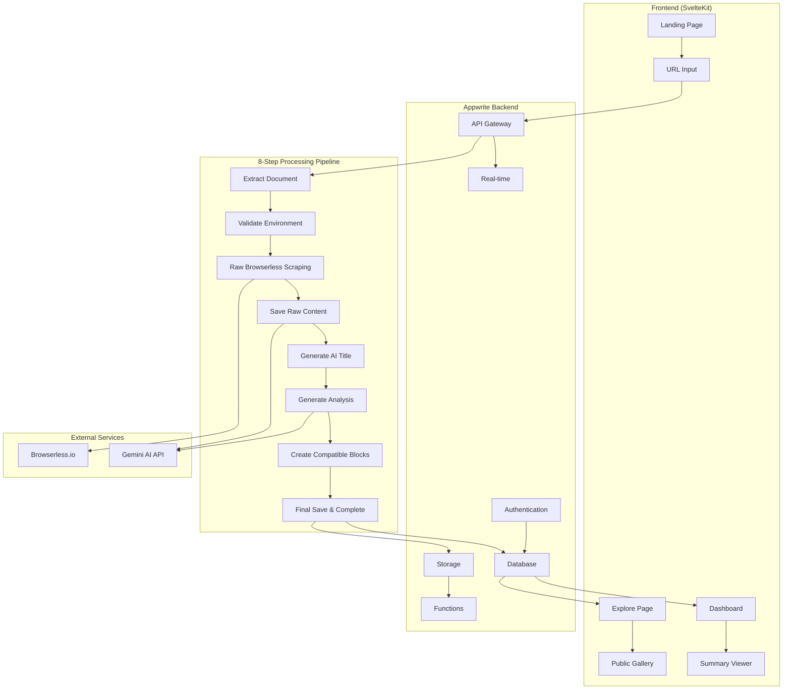
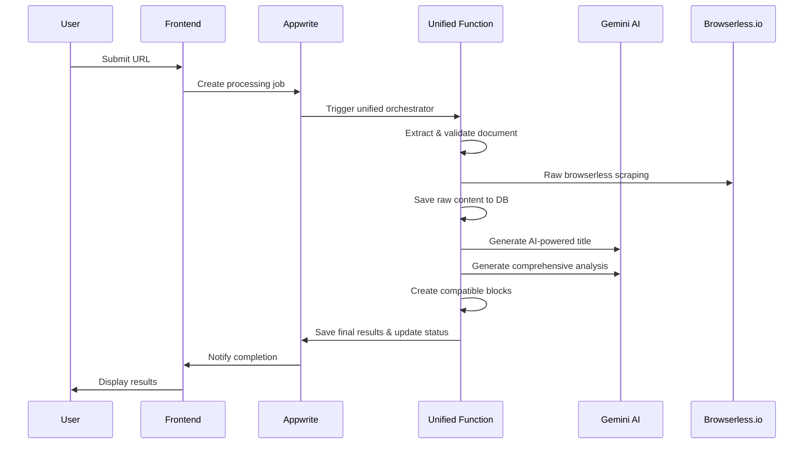
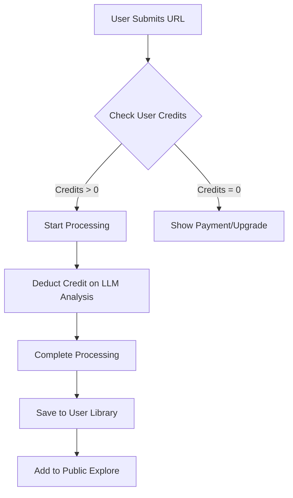
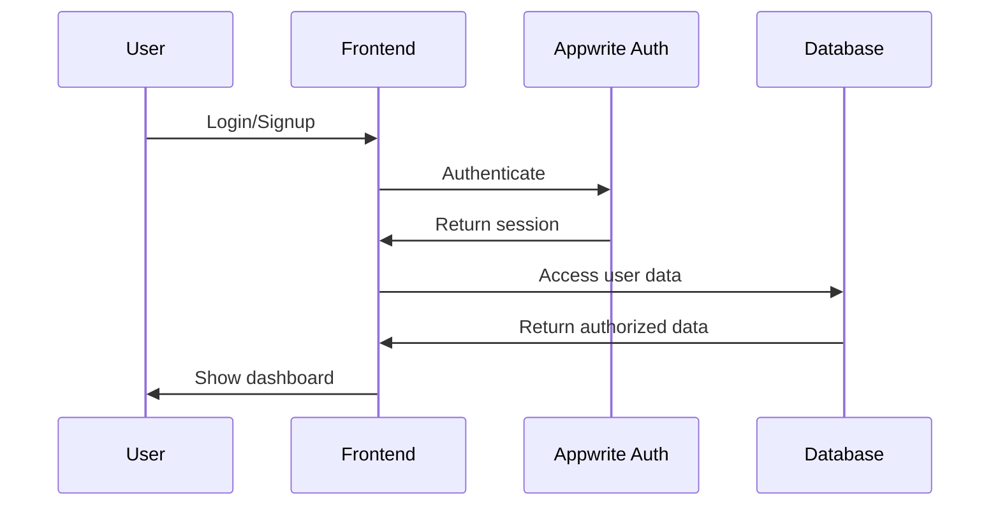

# Docify - System Architecture Plan

## 🏗️ High-Level Architecture



## 🔄 Data Flow Architecture

### 1. User Journey Flow


### 2. Credit System Flow


## 🗄️ Database Schema Design

### Collections Structure

#### Users Collection
```javascript
{
  $id: "users",
  name: "Users",
  attributes: [
    { key: "email", type: "email", required: true },
    { key: "name", type: "string", size: 255, required: true },
    { key: "credits", type: "integer", default: 5, required: true },
    { key: "totalSummaries", type: "integer", default: 0 },
    { key: "publicSummaries", type: "integer", default: 0 },
    { key: "lastActive", type: "datetime" },
    { key: "preferences", type: "string", size: 1000 } // JSON
  ]
}
```

#### Summaries Collection
```javascript
{
  $id: "summaries",
  name: "Summaries",
  attributes: [
    { key: "userId", type: "string", size: 36, required: true },
    { key: "title", type: "string", size: 255, required: true },
    { key: "originalUrl", type: "url", required: true },
    { key: "urlHash", type: "string", size: 64 }, // For duplicate detection
    { key: "status", type: "enum", elements: ["pending", "scraping", "validating", "analyzing", "completed", "failed"], required: true },
    { key: "contentType", type: "string", size: 50 },
    { key: "scrapedDataId", type: "string", size: 36 }, // Storage file ID
    { key: "analysisData", type: "string", size: 10000 }, // JSON
    { key: "mermaidDiagrams", type: "string", size: 5000, array: true },
    { key: "htmlPreview", type: "string", size: 10000 },
    { key: "markdownSummary", type: "string", size: 5000 },
    { key: "tags", type: "string", size: 50, array: true },
    { key: "isPublic", type: "boolean", default: true },
    { key: "downloadCount", type: "integer", default: 0 },
    { key: "viewCount", type: "integer", default: 0 },
    { key: "processingTime", type: "integer" }, // seconds
    { key: "errorMessage", type: "string", size: 500 },
    { key: "createdAt", type: "datetime", required: true },
    { key: "updatedAt", type: "datetime", required: true }
  ],
  indexes: [
    { key: "userId_status", type: "key", attributes: ["userId", "status"] },
    { key: "public_created", type: "key", attributes: ["isPublic", "createdAt"] },
    { key: "url_hash", type: "unique", attributes: ["urlHash"] }
  ]
}
```

#### Processing Jobs Collection
```javascript
{
  $id: "processing_jobs",
  name: "Processing Jobs",
  attributes: [
    { key: "summaryId", type: "string", size: 36, required: true },
    { key: "userId", type: "string", size: 36, required: true },
    { key: "stage", type: "enum", elements: ["scraping", "validating", "analyzing", "completed", "failed"], required: true },
    { key: "progress", type: "integer", default: 0 }, // 0-100
    { key: "logs", type: "string", size: 2000, array: true },
    { key: "errors", type: "string", size: 500, array: true },
    { key: "startTime", type: "datetime", required: true },
    { key: "endTime", type: "datetime" },
    { key: "functionExecutionIds", type: "string", size: 36, array: true }
  ]
}
```

#### Analytics Collection
```javascript
{
  $id: "analytics",
  name: "Analytics",
  attributes: [
    { key: "summaryId", type: "string", size: 36, required: true },
    { key: "userId", type: "string", size: 36 },
    { key: "action", type: "enum", elements: ["view", "download", "share"], required: true },
    { key: "userAgent", type: "string", size: 500 },
    { key: "ipHash", type: "string", size: 64 },
    { key: "timestamp", type: "datetime", required: true }
  ]
}
```

## 🔧 Function Architecture

### Unified Function: Docify Orchestrator
```javascript
// functions/docify-unified-orchestrator/
{
  name: "docify-unified-orchestrator",
  runtime: "python-3.9",
  timeout: 500, // 8 minutes (8-step process)
  memory: 1024,
  environment: {
    GEMINI_API_KEY: "secret",
    BROWSERLESS_API_KEY: "optional",
    DATABASE_ID: "docify_db",
    DOCUMENTS_COLLECTION_ID: "documents_table"
  },
  triggers: ["database"],
  dependencies: {
    "google-genai": "^0.8.0",
    "requests": "^2.31.0",
    "chardet": "^5.2.0",
    "beautifulsoup4": "^4.12.0",
    "appwrite": "^13.0.0"
  }
}
```

#### 8-Step Processing Pipeline:
1. **Extract Document Data** - Parse request and validate inputs
2. **Validate Environment** - Check API keys and configuration
3. **Raw Browserless Scraping** - Scrape content without modification
4. **Save Raw Content** - Store exact HTML in database
5. **Generate AI Title** - Create 2-4 word intelligent titles
6. **Generate Analysis** - Produce comprehensive AI analysis
7. **Create Compatible Blocks** - Format blocks for frontend
8. **Final Save & Complete** - Update database and mark complete

## 🌐 API Endpoints Design

### REST API Structure
```
POST   /api/summaries              # Create new summary
GET    /api/summaries              # Get user's summaries
GET    /api/summaries/:id          # Get specific summary
PUT    /api/summaries/:id          # Update summary
DELETE /api/summaries/:id          # Delete summary
GET    /api/summaries/:id/download # Download summary files

GET    /api/explore                # Get public summaries
GET    /api/explore/:id            # Get public summary details

GET    /api/users/profile          # Get user profile
PUT    /api/users/profile          # Update user profile
GET    /api/users/credits          # Get credit balance
POST   /api/users/credits/purchase # Purchase credits

GET    /api/jobs/:id               # Get processing job status
POST   /api/jobs/:id/cancel        # Cancel processing job

POST   /api/analytics/track        # Track user actions
```

### Real-time Subscriptions
```javascript
// Subscribe to processing updates
client.subscribe('databases.summaries.documents.{summaryId}', response => {
  // Update UI with processing progress
});

// Subscribe to user credit updates
client.subscribe('databases.users.documents.{userId}', response => {
  // Update credit display
});
```

## 🏗️ Storage Architecture

### File Organization
```
/storage/
├── scraped-content/
│   ├── {summaryId}/
│   │   ├── raw-content.json
│   │   ├── processed-content.json
│   │   └── metadata.json
├── generated-summaries/
│   ├── {summaryId}/
│   │   ├── summary.md
│   │   ├── summary.pdf
│   │   ├── diagrams/
│   │   │   ├── diagram-1.svg
│   │   │   └── diagram-2.svg
│   │   └── preview.html
└── user-exports/
    ├── {userId}/
    │   └── {summaryId}/
    │       ├── complete-export.zip
    │       └── metadata.json
```

### Storage Permissions
```javascript
// Scraped content - private to system
"read('any')", "write('team:developers')"

// Generated summaries - public read, owner write
"read('any')", "write('user:{userId}')"

// User exports - private to user
"read('user:{userId}')", "write('user:{userId}')"
```

## 🔐 Security Architecture

### Authentication Flow


### Permission Levels
- **Guest**: View public summaries, limited API access
- **Authenticated**: Create summaries, manage own content
- **Premium**: Higher credit limits, priority processing
- **Admin**: System monitoring, user management

## 📊 Monitoring & Analytics

### System Metrics
- Function execution times and success rates
- Database query performance
- Storage usage patterns
- API response times
- Error rates and types

### Business Metrics
- User registration and retention
- Credit consumption patterns
- Popular content types and URLs
- Download and sharing statistics
- Processing success rates

### Alerting System
- Function failures or timeouts
- High error rates
- Storage quota warnings
- Unusual usage patterns
- Security incidents

---

*This architecture plan provides a comprehensive blueprint for building Docify with scalability, security, and performance in mind.*
